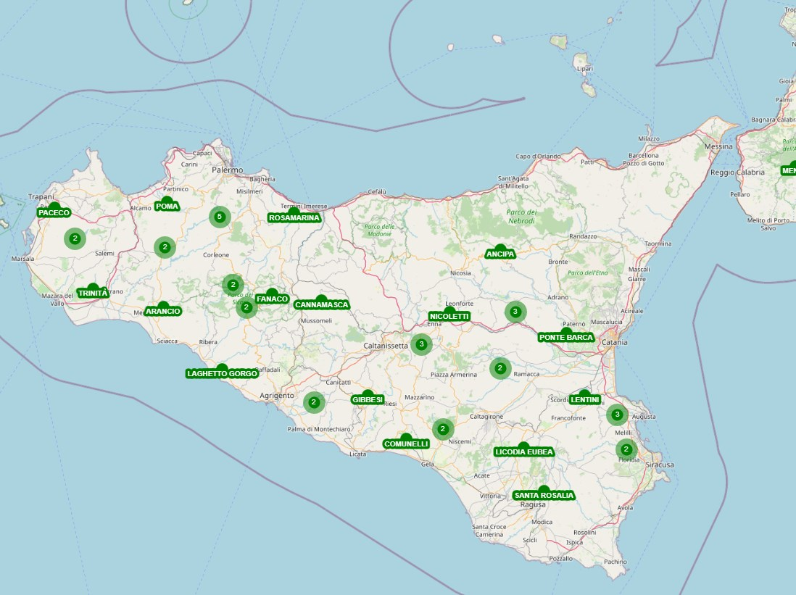

[{class="crop gray off" align=left}](index.md)

Le grandi dighe italiane rappresentano un esempio notevole di ingegneria idraulica e sostenibilità ambientale. Queste imponenti strutture idroelettriche sono state progettate per sfruttare le risorse idriche, fornendo energia pulita, regolando il flusso dei fiumi e garantendo un approvvigionamento idrico affidabile per diverse regioni del paese. In questo articolo, esploreremo alcune delle grandi dighe italiane più significative e il loro contributo alla società e all'ambiente. <!-- more --> Sono un patrimonio di ingegneria e sostenibilità che svolgono un ruolo fondamentale nella fornitura di energia pulita, nell'approvvigionamento idrico e nella gestione delle risorse idriche. Nonostante le controversie e gli eventi tragici che talvolta le accompagnano, queste dighe rappresentano un esempio di come la tecnologia idraulica può essere utilizzata in modo sostenibile per il benessere della società e la tutela dell'ambiente.

# MIT La cartografia digitale
La cartografia digitale che segue riporta la localizzazione delle grandi dighe di competenza della Direzione Generale per le Dighe e le Infrastrutture idriche sul territorio nazionale. La cartografia è corredata di funzionalità GIS relativamente avanzate, senza richiedere implementazioni software specialistiche. 
La cartografia digitale consente:

-    la consultazione alcuni strati informativi del SIT della Direzione Generale con possibilità di produrre carte personalizzate secondo necessità;
-    l’esecuzione di ricerche geografiche in base ad attributi territoriali non contenute direttamente nelle banche dati alfanumeriche;
-    la semplicità di accesso e di utilizzo dei controlli per diffondere il più possibile la metodologia di analisi;
-    la rapidità di elaborazione, compatibilmente con le dimensioni dei dati, rispetto ad applicazioni WEB tradizionali.

Fonte dati: MIT - [Ministero delle Infrastrutture e dei Trasporti - Direzione generale per le dighe le infrastrutture idriche](https://dgdighe.mit.gov.it/categoria/articolo/_cartografie_e_dati/_cartografie/cartografia_dighe)

<iframe title="Cartografia delle grandi dighe" aria-label="Mappa" src="https://dgdighe.mit.gov.it/CartografiaDighe/mappa-dighe" scrolling="no" frameborder="0" style="width: 0; min-width: 100% !important; border: none;" height="950" data-external="1"></iframe>

 
<iframe title="UTD Palermo - Registro delle grandi dighe" aria-label="Tabella" id="datawrapper-chart-xhTbd" src="https://datawrapper.dwcdn.net/xhTbd/2/" scrolling="no" frameborder="0" style="width: 0; min-width: 100% !important; border: none;" height="1387" data-external="1"></iframe>

Fonte dati: MIT - [Elenco delle dighe di competenza dell'ufficio tecnico per le dighe di Palermo](https://dgdighe.mit.gov.it/categoria/articolo/_cartografie_e_dati/_dighe_di_competenza/UTDPA)